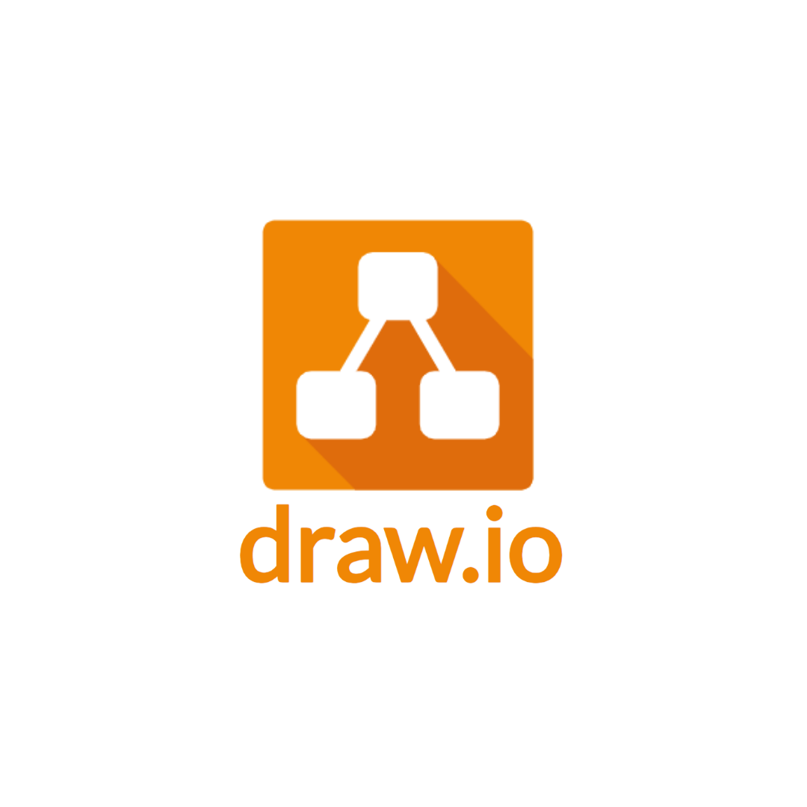
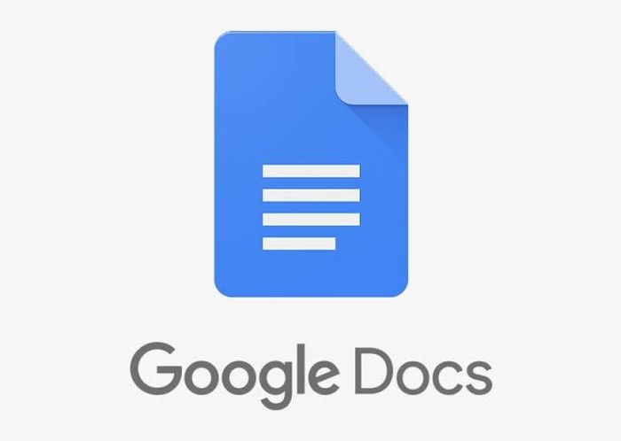
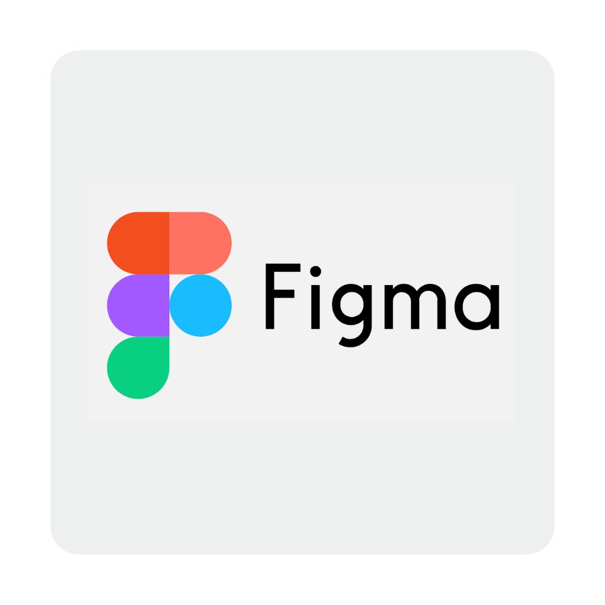

# GameBoardCafe

[English](#english) | [Bahasa Indonesia](#bahasa-indonesia)

---
## English

A simple web application to support **GameBoardCafe** operations by managing facilities such as **meeting rooms** and **board games**, and recording borrowing/return transactions handled by **staff/admin**.

## Tech Stack
- HTML
- CSS
- JavaScript

## Quick Links
|  |  |  |  |
|:--:|:--:|:--:|:--:|
| <a href="https://drive.google.com/file/d/1mOBi8U2rkN1rIOJebbo76Q3_RMUNiDM_/view?usp=drive_link"><b>Draw.io</b></a> | <a href="https://docs.google.com/document/d/1onMJMiBkqwzek5xLITTpUI5rOus6pjHE_KLs4TzS93A/edit?usp=sharing"><b>Google Doc</b></a> | <a href="https://www.figma.com/design/hHw2XbozPWKPCNQGPS6cqr/Untitled?node-id=0-1&t=LHoQy3QKppO29IhA-1"><b>Figma</b></a> | <a href="https://www.youtube.com/playlist?list=PLRBTkzAH5kopZHyI1hrZrlTMB81AA4-HL"><b>YouTube</b></a> |

## Key Features
- Staff/admin login
- View facility list (meeting rooms & board games)
- Record borrowing transactions
- Record returns
- View borrowing history

## Folder Structure (Example)
- `index.html` — main page
- `styles.css` — stylesheets
- `app.js` — application logic
- `assets/` — icons and images

## How to Run
1. Clone this repository.
2. Open `index.html` in your browser.

> Note: This project can be extended with data persistence (e.g., LocalStorage or a database) as needed.

---
## Bahasa Indonesia

Aplikasi web sederhana untuk membantu operasional **GameBoardCafe** dalam mengelola fasilitas seperti **meeting room** dan **board game**, serta pencatatan peminjaman dan pengembalian oleh **admin/petugas**.

## Teknologi
- HTML
- CSS
- JavaScript

## Tautan Cepat
|  |  |  |  |
|:--:|:--:|:--:|:--:|
| <a href="https://drive.google.com/file/d/1mOBi8U2rkN1rIOJebbo76Q3_RMUNiDM_/view?usp=drive_link"><b>Draw.io</b></a> | <a href="https://docs.google.com/document/d/1onMJMiBkqwzek5xLITTpUI5rOus6pjHE_KLs4TzS93A/edit?usp=sharing"><b>Google Doc</b></a> | <a href="https://www.figma.com/design/hHw2XbozPWKPCNQGPS6cqr/Untitled?node-id=0-1&t=LHoQy3QKppO29IhA-1"><b>Figma</b></a> | <a href="https://www.youtube.com/playlist?list=PLRBTkzAH5kopZHyI1hrZrlTMB81AA4-HL"><b>YouTube</b></a> |

## Fitur Utama
- Login admin/petugas
- Melihat daftar fasilitas (meeting room & board game)
- Mencatat peminjaman fasilitas/perlengkapan
- Mencatat pengembalian
- Melihat riwayat peminjaman

## Struktur Folder (Contoh)
- `index.html` — halaman utama
- `style.css` — stylesheet
- `app.js` — logika aplikasi
- `assets/` — ikon dan gambar

## Cara Menjalankan
1. Clone repository ini.
2. Buka `index.html` di browser.

> Catatan: Proyek ini dapat dikembangkan untuk menambahkan penyimpanan data (misalnya LocalStorage atau database) sesuai kebutuhan.

